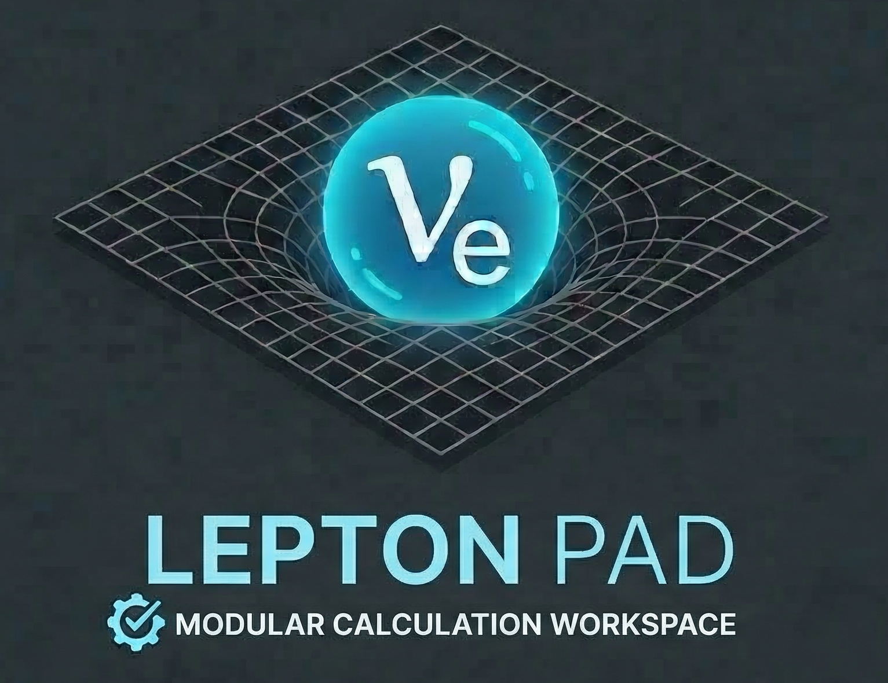

# LeptonPad



A high-performance, web-native engineering workbench — TypeScript solver compiled to WebAssembly, drag-and-drop canvas, offline-first PWA, with account-based access control and encrypted section template packs.

**[Launch LeptonPad](https://leptonpad.jrmarcum.deno.net/)**

---

## What is LeptonPad?

LeptonPad is a browser-based engineering calculation pad. It gives structural and mechanical engineers a live, programmable workspace where formulas evaluate in real time, beam deflection and section properties are solved at native speed, and results can be assembled into a paginated, printable report — all without installing software or connecting to a server.

Key characteristics:

- **No cloud required.** The app runs fully offline — everything is cached locally by the service worker, including your auth session and purchased template pack keys.
- **Mathematically rigorous.** The expression evaluator tracks units and propagates dimensional analysis through every formula row.
- **Composable.** Results from one block are automatically available as variables in every block below it on the same canvas.
- **Report-ready.** The canvas follows an A4/Letter page grid so that your layout matches a printed or exported document.
- **Secure templates.** Purchased section template packs are AES-256-GCM encrypted — copying a project file does not grant access without a valid account.

---

## Accounts and Access

LeptonPad uses Supabase for authentication. Sign in or create an account from the sidebar.

### User Roles

| Role      | Access                                                      |
| --------- | ----------------------------------------------------------- |
| **Free**  | All non-section blocks; can use purchased template packs    |
| **Demo**  | Full Pro access for 30 days from trial activation           |
| **Pro**   | Create and edit all section blocks; use all purchased packs |
| **Super** | Full access to everything (admin)                           |

### License Codes

Pro subscriptions and section template packs are activated by entering a one-time license code via the **Redeem Code** button in the sidebar. Codes are year-based by default. No card numbers are stored.

### Offline Use

Once signed in, your session and purchased template pack keys are cached locally — the app works without a network connection.

---

## User Guide

### The Canvas

When LeptonPad opens you see a two-panel layout:

| Panel          | Purpose                                                     |
| -------------- | ----------------------------------------------------------- |
| Sidebar (left) | Account panel, block palette, custom tools                  |
| Canvas (right) | The working surface — blocks live here on a 20 px snap grid |

Each canvas page is A4-sized (or Letter, A3, etc. depending on your project settings). The canvas grows downward automatically as you add content.

---

### Block Types

#### Formula Block

The core calculation block. Each row is an independent expression:

```text
b = 150          → assigns variable b = 150
h = 300          → assigns variable h = 300
A = b * h        → evaluates to 45000
Ix = b*h^3/12    → evaluates to 337500000
```

- Assign variables with `=` — they become available to all blocks below.
- Reference variables by name anywhere on the canvas (within the same scope).
- Supports inline units: `F = 10 kN`, `L = 6000 mm`.
- Control flow: `if(cond, then, else)` and `clamp(x, min, max)` are built-in.
- Define reusable functions: `f(x) = 2*x^2 + 3`.
- Results display to the right of each row with their computed units.

**Supported operators:** `+ - * / ^ ( ) == != < > <= >= and or xor`

**Built-in functions:** `sin cos tan sqrt cbrt abs exp log floor ceil round sign min max atan2 mod pow hypot if clamp factorial gamma lgamma erf comb perm`

**Constants:** `pi e tau`

---

#### Beam Deflection Block

Computes mid-span deflection for a simply-supported beam with a central point load.

| Input                 | Symbol | Unit |
| --------------------- | ------ | ---- |
| Point load            | P      | kN   |
| Span                  | L      | mm   |
| Elastic modulus       | E      | MPa  |
| Second moment of area | I      | mm⁴  |

**Output:** δmax (mm) — computed using δ = PL³ / (48EI).

---

#### Section Properties Block

Computes properties for a rectangular cross-section.

| Input  | Symbol | Unit |
| ------ | ------ | ---- |
| Width  | b      | mm   |
| Height | h      | mm   |

**Outputs:** Area (mm²), Ix (mm⁴).

---

#### Plot Block

Renders an SVG curve from a math expression over a variable range.

- Enter any expression using variables defined above (e.g. `sin(x * pi / L) * delta`).
- Set the `x` range, number of evaluation points, and axis labels.
- Add permanent markers at specific x-values with custom labels.
- Plot colors adapt automatically to dark/light mode.

---

#### Section Block *(Pro / Demo)*

A collapsible container that groups related blocks under a shared namespace. Requires a Pro subscription or active Demo trial to create.

- Blocks inside a Section prefix their variables with the section name (e.g. `Beam.Ix`).
- Collapse the section to hide detail and show only a summary line.
- The summary line shows user-configured output variables and pass/fail comparisons.
- Sections can be colour-coded for quick visual reference.

**Purchased template packs** provide pre-built, encrypted Section blocks available to all users who own the pack — no Pro subscription required.

**Marketplace templates** *(coming soon)* — community members will be able to submit and sell their own Section template packs through the LeptonPad marketplace.

---

#### Text Block

A freeform Markdown text block for notes, assumptions, and narrative.

- Supports bold, italic, headings, lists, and inline code via a formatting toolbar.
- Greek letters are entered as their English name and rendered as the symbol (e.g. `alpha` → α).
- Math expressions inside `$...$` or `$$...$$` delimiters are rendered as formatted math.
- Toggle between edit and preview mode with a single click.

---

#### Figure Block

An image block with an auto-numbered caption.

- Click the placeholder or paste an image to embed it.
- Captions are editable; figure numbers increment automatically across the canvas.
- Images are stored as Base64 data URLs inside the project file.

---

### Canvas Interactions

| Action            | How                                                                     |
| ----------------- | ----------------------------------------------------------------------- |
| Place a block     | Double-click a module in the sidebar                                    |
| Drag a block      | Drag from the sidebar to a canvas position                              |
| Move a block      | Drag it to a new position (snaps to 20 px grid)                         |
| Select a block    | Click it (blue border indicates selection)                              |
| Multi-select      | Hold Shift or Ctrl while clicking, or rubber-band drag on empty canvas  |
| Delete selected   | Press Delete or Ctrl+Delete                                             |
| Undo deletion     | Press Ctrl+Z                                                            |
| Nudge selected    | Ctrl + Arrow keys (one grid step)                                       |
| Push blocks down  | Shift+Enter — shifts all blocks below the cursor down one grid row      |
| Pull blocks up    | Ctrl+Shift+Enter — shifts all blocks below the cursor up one row        |
| Deselect          | Press Escape or click empty canvas                                      |
| Resize a block    | Drag the right edge of blocks that support it                           |

---

### Projects

#### Saving and Loading

- **Save:** Click **Save** in the sidebar — uses the browser File System Access API to write a `.json` file to your chosen location.
- **Save As:** Click **Save As** to save to a new file.
- **Load:** Click **Load Project** and select a previously saved `.json` file.
- **New:** Click **New Project** — you will be prompted before unsaved changes are discarded.
- **Template:** Click **New from Template** to start from an existing project as a base.

#### Project File Format

Projects are stored as human-readable JSON containing the block list, global constants, and project metadata (name, date, units, title block fields). Purchased template section blocks are stored as encrypted ciphertext only — the plaintext content is never written to disk.

---

### Title Block

Each page has an optional title block at the bottom — a standard engineering drawing title panel with editable fields:

`Project` · `Subject` · `Drawn by` · `Date` · `Job No.` · `Sheet No.` · `Logo`

Click any field to edit it. Upload a company logo by clicking the logo placeholder in the title block.

---

### Custom Modules

Frequently used block groups (e.g. a standard material properties section) can be saved as a **Custom Module** and reloaded in any project from the sidebar. Custom modules are exported and imported as JSON, making them easy to share with a team.

---

## Build and Development

```bash
deno task dev        # hot-reload dev server → http://localhost:5173
deno task build      # production build → dist/
deno task serve      # dev server for pre-built dist/
deno task serve:prod # production server (no dev features)
```

### Local configuration

Create a `.env` file in the project root with your Supabase credentials:

```env
SUPABASE_URL=https://your-project-id.supabase.co
SUPABASE_ANON_KEY=your-anon-key
```

`deno task build` reads these and writes them into `dist/config.js`. If no `.env` file is present, `public/config.js` is used as the fallback for local dev.

### Deno Deploy

- **Build command:** `deno task build`
- **Entrypoint:** `main.ts`
- **Environment variables:** set `SUPABASE_URL` and `SUPABASE_ANON_KEY` in the Deno Deploy dashboard — the build step injects them into `dist/config.js` automatically.

### Supabase setup

1. Create a project at [supabase.com](https://supabase.com)
2. Run `supabase/schema.sql` in the SQL editor — the script is fully idempotent and can be re-run safely
3. Paste your project URL and Publishable (anon) key into `public/config.js`
4. Set user roles via the SQL snippets in `CLAUDE.md`

### Releasing a new version

1. Bump `"version"` in `deno.json`
2. Bump the cache name in `public/sw.js` (e.g. `leptonpad-v3`) to force installed PWA users to receive the update
3. Deploy

---

## License

LeptonPad source code, compiled binaries, and brand assets (including the LeptonPad name and logo) are proprietary.
See [LICENSE](LICENSE) for the full terms.

Copyright © 2026 LeptonPad. All rights reserved.
